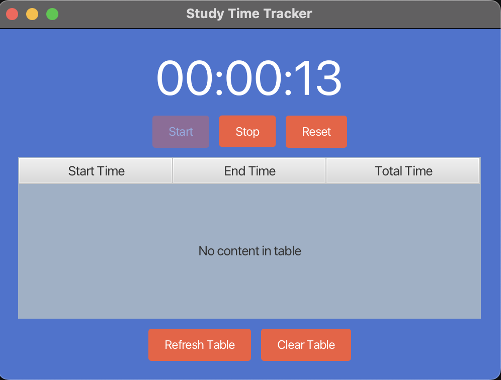
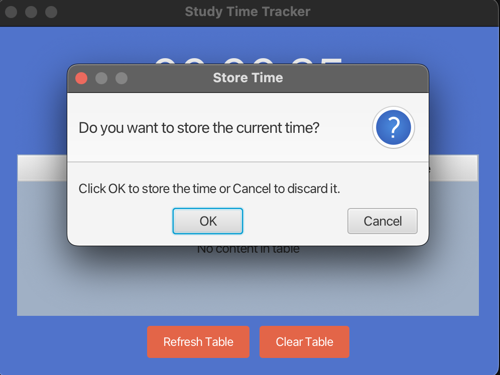
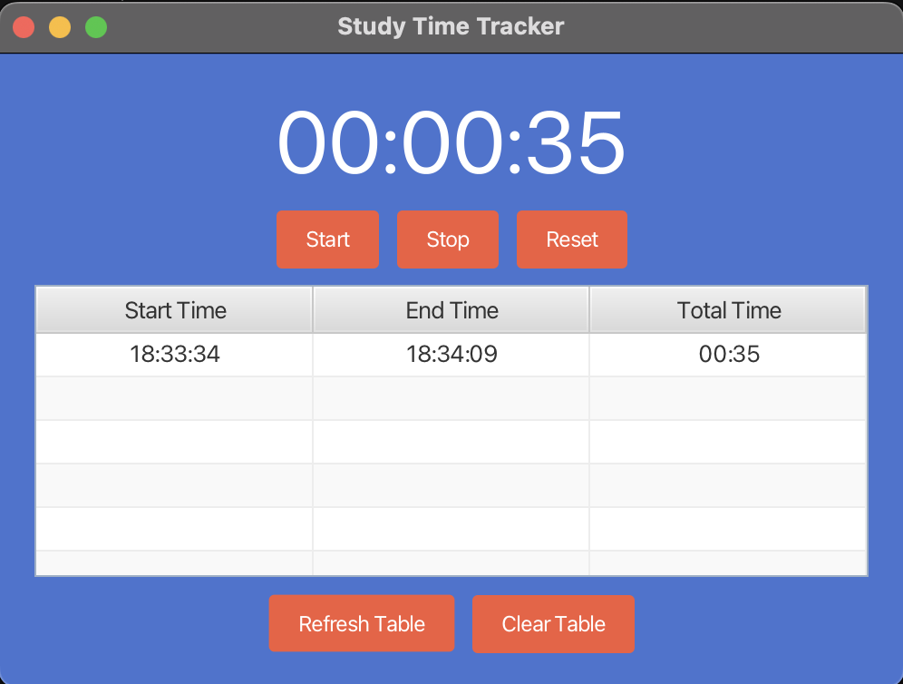

### Java FX Study Time Tracker Application

This application was built using javaFX to track and store study sessions. The user can start the timer and can save the time on the table when stopped. The user can also clear data in the table

#### Main Page

#### Save time alert

#### Time data on table

